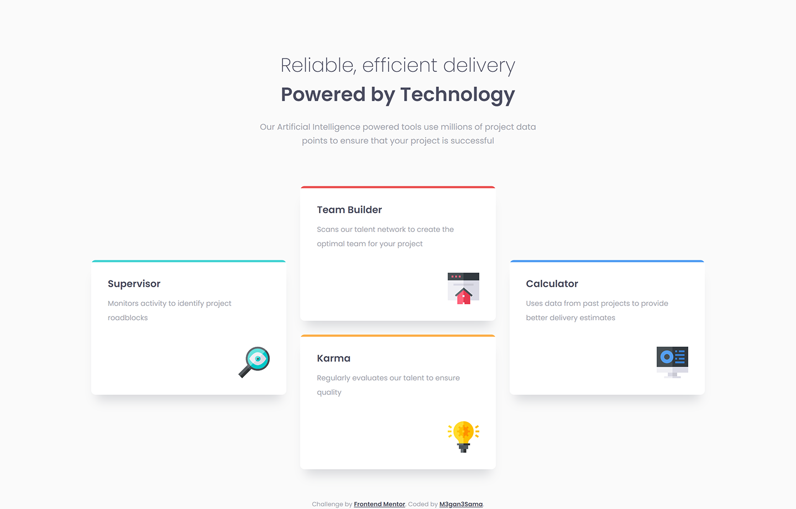
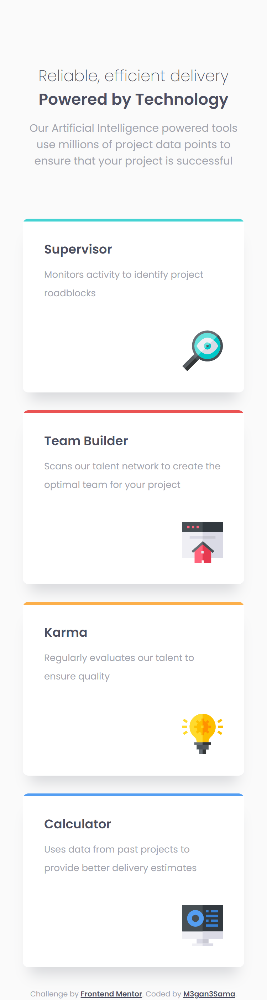

# Frontend Mentor - Four card feature section

This is a solution to the [Four card feature section challenge on Frontend Mentor](https://www.frontendmentor.io/challenges/four-card-feature-section-weK1eFYK).

## Welcome! 👋

Thanks for checking out this front-end coding challenge.

### The challenge

This challenge is to making a data storage layout and make it responsive.

### Screenshot

#### Desktop preview:

<p align="center" width="100%">
  
</p>

---

#### Tablet preview:

<p align="center" width="100%">
  
</p>

---

#### Mobile preview:

<p align="center" width="100%">
  
</p>

---

### Links

- Solution URL: [You can find My solution here](https://github.com/M3gan3Sama/fylo-data-storage-component-master.git)
- Live Site URL: [This is my Live site for This challenge](https://m3gan3sama.github.io/fylo-data-storage-component-master/)

## My process

### Built with

- Semantic HTML5 markup
- CSS
- CSS Grid
- Flexbox
- Media query

### What I learned

I used ``` font-size: clamp(); ``` in this project for the first time.

## Table of contents

- [Frontend Mentor - Four card feature section](#frontend-mentor---four-card-feature-section)
  - [Welcome! 👋](#welcome-)
    - [The challenge](#the-challenge)
    - [Screenshot](#screenshot)
      - [Desktop preview:](#desktop-preview)
      - [Tablet preview:](#tablet-preview)
      - [Mobile preview:](#mobile-preview)
    - [Links](#links)
  - [My process](#my-process)
    - [Built with](#built-with)
    - [What I learned](#what-i-learned)
  - [Table of contents](#table-of-contents)
